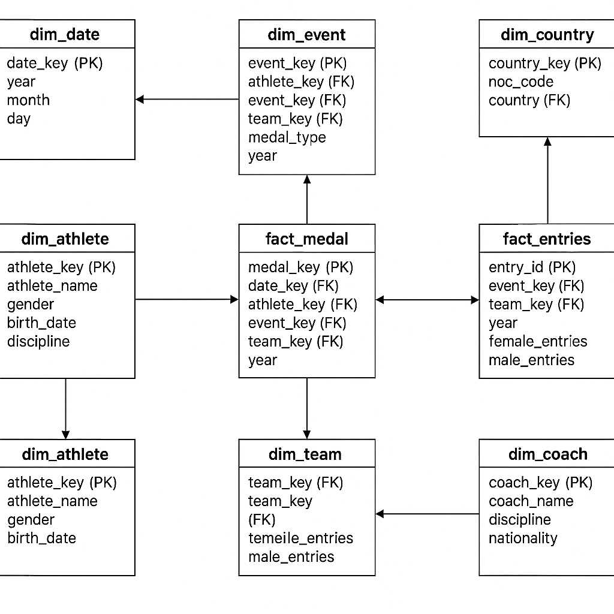

#Olympics Data Analytics Platform using Azure (ADF, Databricks, Synapse, Power BI)

##Project Overview
This project demonstrates a modern data engineering and analytics pipeline using Microsoft Azure. It includes data ingestion, transformation, warehousing, and visualization using Azure-native tools. The dataset is based on Olympic historical data (Athletes, Coaches, Medals, etc.).

🔄 Project Workflow Diagram:
(Use the attached architecture image in your GitHub README.md and describe each stage briefly)

🔧 Tools & Technologies Used:
Azure Data Factory (ADF) – Data ingestion

Azure Data Lake Storage Gen2 – RAW & Curated zone

Azure Databricks (PySpark) – Data transformation

Azure Synapse Analytics / Azure SQL Server – Data warehouse and analytics layer

Power BI – Business insights and dashboards

📊 Dataset Overview:
File Name	Description
Athletes.csv: Athlete name, discipline, country, birth details
Coaches.csv: Coach name, discipline, and nationality
EntriesGender.csv	Gender-wise event entries per discipline, team
Medals.csv	Medal winners by discipline, event, team, athlete
Teams.csv	Team metadata (team name, country, etc.)

🔁 Workflow Stages:
Ingestion (ADF):

Read .csv files from on-prem/cloud and load into Data Lake Gen2 (RAW zone)

Transformation (Databricks):

Clean & process the RAW data

Join across datasets, normalize formats, and handle missing values

Write transformed datasets into the curated zone in Data Lake Gen2

Analytics (Synapse/Azure SQL):

Load transformed data into the dimension and fact tables

Define relationships and business metrics

Dashboarding (Power BI):

Connect to Synapse or SQL views

Develop interactive dashboards and insights

🧹 Data Cleaning & Transformation
Performed in Azure Databricks (PySpark):

Null handling for birth dates, medals, or team fields

Standardized country and discipline names

Join logic between Medals, Athletes, Teams

Gender-based aggregation using EntriesGender.csv

Created calculated columns: age, medal counts, team rankings

🧠 Business Insights
Use Power BI to answer:

🥇 Which countries have the highest medal counts?

👨‍💻 Which disciplines are most competitive?

🎯 Gender-wise participation trends?

🧑‍🦰 Top athletes by medals?

🌍 Region-based performance comparison?

🧱 Olympics Analytics Data Model
   

🗃️ Dimension Tables:
Table Name	Description
dim_athlete	Name, birthdate, discipline, country
dim_team	Team name, NOC (country), region
dim_coach	Coach name, discipline, nationality
dim_event	Event name, discipline, gender

📈 Fact Table:
Table Name	Description
fact_medal	Foreign keys to athletes, team, event; medal type
fact_entries	Gender-based event entry counts

📁 olympics-data-azure-pipeline
├── 📂 data
│   ├── Athletes.csv
│   ├── Coaches.csv
│   ├── EntriesGender.csv
│   ├── Medals.csv
│   └── Teams.csv
├── 📂 notebooks
│   └── databricks_etl_notebook.py
├── 📂 sql
│   ├── synapse_dim_fact_creation.sql
│   └── sample_queries.sql
├── 📂 powerbi
│   └── dashboard_screenshots/
├── 📂 images
│   └── architecture.jpg
├── README.md
└── requirements.txt (if Python env used)

                            
