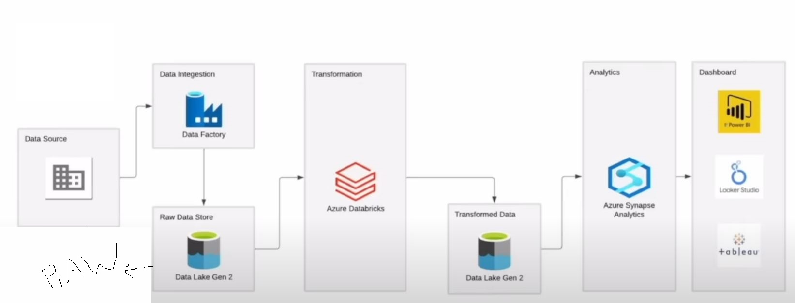

# Olympics Data Analytics Platform using Azure (ADF, Databricks, Synapse, Power BI)

## Project Overview:

This project demonstrates a modern data engineering and analytics pipeline using Microsoft Azure. It includes data ingestion, transformation, warehousing, and visualization using Azure-native tools. The dataset is based on Olympic historical data (Athletes, Coaches, Medals, etc.).

## 🔄 Project Workflow Diagram:

## 🔧Tools & Technologies Used:
Azure Data Factory (ADF) – Data ingestion

Azure Data Lake Storage Gen2 – RAW & Curated zone

Azure Databricks (PySpark) – Data transformation

Azure Synapse Analytics / Azure SQL Server – Data warehouse and analytics layer

Power BI – Business insights and dashboards

## 📊 Dataset Overview:
| Table Name    | Description                          |
| ------------- | ------------------------------------ |
| `dim_athlete` | Name, birthdate, discipline, country |
| `dim_team`    | Team name, NOC (country), region     |
| `dim_coach`   | Coach name, discipline, nationality  |
| `dim_event`   | Event name, discipline, gender       |

## 🔁 Workflow Stages:
Ingestion (ADF):

Read .csv files from on-prem/cloud and load into Data Lake Gen2 (RAW zone)

Transformation (Databricks):

Clean & process the RAW data

Join across datasets, normalize formats, and handle missing values

Write transformed datasets into the curated zone in Data Lake Gen2

Analytics (Synapse/Azure SQL):

Load transformed data into the dimension and fact tables

Define relationships and business metrics

Dashboarding (Power BI):

Connect to Synapse or SQL views

Develop interactive dashboards and insights

## 🧹 Data Cleaning & Transformation
Performed in Azure Databricks (PySpark):

Null handling for birth dates, medals, or team fields

Standardized country and discipline names

Join logic between Medals, Athletes, and Teams

Gender-based aggregation using EntriesGender.csv

Created calculated columns: age, medal counts, team rankings

## 🧠 Business Insights
Use Power BI to answer:

🥇 Which countries have the highest medal counts?

👨‍💻 Which disciplines are most competitive?

🎯 Gender-wise participation trends?

🧑‍🦰 Top athletes by medals?

🌍 Region-based performance comparison?

## 🧱 Olympics Analytics Data Model
   

## 🗃️ Dimension Tables:
| Table Name    | Description                          |
| ------------- | ------------------------------------ |
| `dim_athlete` | Name, birthdate, discipline, country |
| `dim_team`    | Team name, NOC (country), region     |
| `dim_coach`   | Coach name, discipline, nationality  |
| `dim_event`   | Event name, discipline, gender       |

## 📈 Fact Table:
| Table Name     | Description                                       |
| -------------- | ------------------------------------------------- |
| `fact_medal`   | Foreign keys to athletes, team, event; medal type |
| `fact_entries` | Gender-based event entry counts                   |

## Power BI Reports:
                          
